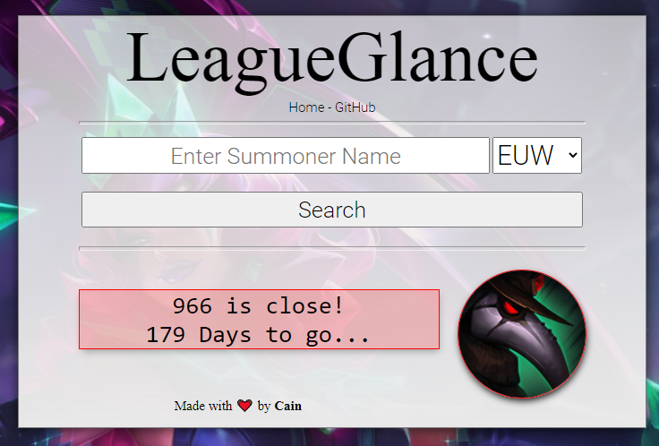

# LeagueGlance
LeagueGlance was a League of Legends Summoner Name Look-up Tool that was made to track when Names were going to become available to use. This was because previously Summoner Names we're unique and only 1 person could have a certain name, LeagueGlance also sold premium names that I had already claimed myself, this was through the Digital Products site [Shoppy.gg](https://shoppy.gg/) (Often for $5-15 each) 

⚠️ I am uploading this code purely for portfolio purposes, this code is over 4 years old, I just think its a neat project that I made from scratch without any help from framework or libraries.

## Screenshots

## Tech Stack
- HTML
- CSS
- Javascript
- PHP
- MySQL Database

## External Resources
- Shoppy.gg
- Google ReCAPTCHA
- League of Legends API

## More Screenshots

